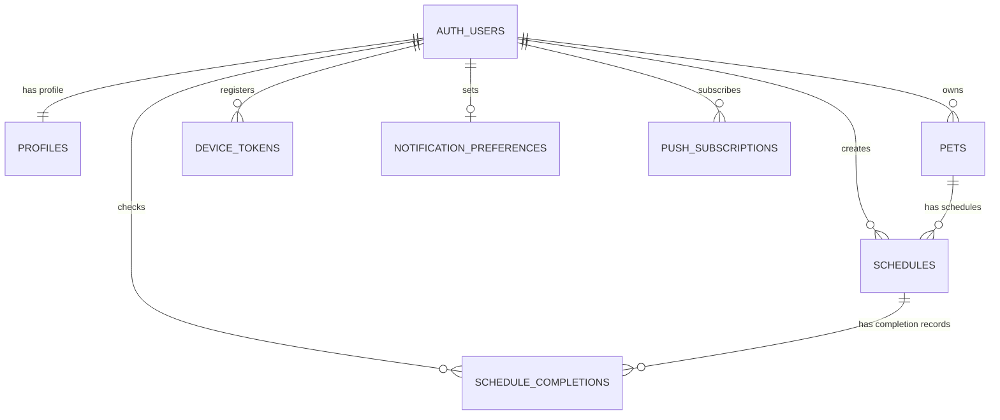

# 챙겨펫

## 목적

반복적으로 발생하는 일정을 한 곳에서 기록하고 확인하는 흐름을 이해하기 위해 진행한 프로젝트입니다.  
사용자별 정보와 일정 데이터를 분리해 관리하고, 완료 여부를 기록하는 구조를 직접 구성해보는 데 목적을 두었습니다.

## 프로젝트 소개

Next.js와 Supabase를 기반으로 구현한 반려동물 일정 관리 웹앱 프로젝트입니다.  
사용자별로 반려동물 정보를 등록하고, 밥, 산책, 약, 병원 일정 등을 관리할 수 있도록 구성했습니다.

반려동물 등록, 일정 등록, 반복 일정, 오늘 일정 확인, 완료 체크, 완료 기록 저장, 알림 토큰 저장 기능 등을 구현했습니다.

## Preview


## 프로젝트 목표

- 반려동물별 반복 일정을 한곳에서 관리
- 오늘 해야 할 일정과 완료 상태를 빠르게 확인
- 사용자별 데이터 분리와 Row Level Security 적용
- Android 앱 푸시 알림 기반의 실사용 알림 구조 설계
- 포트폴리오와 면접에서 설명 가능한 단계적 구현

## 주요 기능

- 인증: Supabase Auth 기반 회원가입, 로그인, 로그아웃
- 세션 관리: Supabase SSR 쿠키 기반 세션 관리
- 반려동물 관리: 로그인 사용자별 반려동물 등록 및 조회
- 일정 관리: 반려동물별 일정 등록 및 조회
- 반복 일정: 매일, 매주, 반복 없음 규칙 처리
- 체크리스트: 오늘 일정 완료 체크 저장
- 데이터 분리: 일정 원본은 `schedules`, 날짜별 완료 기록은 `schedule_completions`로 분리
- 개인정보 표시: 설정 화면과 헤더에서 이메일 일부 마스킹
- Android 앱 알림: FCM 디바이스 토큰 저장, 알림 권한 요청, 테스트 푸시 발송
- 웹 푸시 테스트: PWA/Web Push 검증 패널을 개발용으로 분리

## 기술 스택

| 영역 | 기술 |
| --- | --- |
| Frontend | Next.js App Router, React, TypeScript |
| Styling | Tailwind CSS |
| Auth | Supabase Auth |
| Database | Supabase PostgreSQL |
| Security | Supabase Row Level Security |
| Android App | Capacitor Android |
| Push | Firebase Cloud Messaging, Web Push |
| 배포 예정 | Vercel, Supabase |

## 아키텍처

```txt
사용자
  ├─ Web Browser
  │   └─ Next.js App Router
  │       ├─ Server Components
  │       ├─ Server Actions
  │       └─ Supabase SSR Client
  │
  └─ Android App
      └─ Capacitor WebView
          └─ Next.js 화면 재사용

Next.js
  ├─ Supabase Auth
  ├─ Supabase PostgreSQL
  └─ Firebase Cloud Messaging HTTP v1

Supabase
  ├─ pets
  ├─ schedules
  ├─ schedule_completions
  ├─ device_tokens
  ├─ notification_preferences
  └─ push_subscriptions
```

## 데이터 설계 요약

반복 일정을 매일 미리 생성하지 않고, 일정 원본과 완료 기록을 분리했습니다.

- `schedules`: 반복 규칙을 가진 일정 원본
- `schedule_completions`: 특정 날짜에 사용자가 완료 체크한 기록
- `pets`: 사용자별 반려동물
- `device_tokens`: Android 앱 푸시 수신 토큰
- `notification_preferences`: 알림 사용 여부와 사전 알림 시간
- `push_subscriptions`: 웹 푸시 테스트용 구독 정보

이 구조를 선택한 이유는 반복 일정이 많아져도 DB row가 불필요하게 늘어나지 않고, 완료 기록만 날짜별로 저장할 수 있기 때문입니다.

자세한 DB 설계는 [docs/DATABASE.md](docs/DATABASE.md)를 참고합니다.

## ERD

아래 ERD는 실제 `supabase/migrations`에 정의된 테이블과 컬럼을 기준으로 정리했습니다. Supabase Auth의 `auth.users`는 Supabase가 관리하는 인증 테이블이고, 앱에서 직접 관리하는 공개 스키마 테이블은 `profiles`, `pets`, `schedules`, `schedule_completions`, `device_tokens`, `notification_preferences`, `push_subscriptions`입니다.

### 관계도



### 테이블 관계

- 한 사용자는 하나의 `profiles` row를 가집니다.
- 한 사용자는 여러 `pets`를 등록할 수 있습니다.
- 한 반려동물은 여러 `schedules`를 가질 수 있습니다.
- 한 일정은 날짜별로 여러 `schedule_completions` 기록을 가질 수 있습니다.
- 한 사용자는 여러 Android/Web 기기 토큰을 `device_tokens`에 저장할 수 있습니다.
- 한 사용자는 하나의 `notification_preferences` 설정을 가질 수 있습니다.
- `push_subscriptions`는 웹 푸시 개발 테스트용 구독 정보를 저장합니다.

### 엔티티 목록

| 테이블 | 주요 필드 | 설명 |
| --- | --- | --- |
| `profiles` | `id(PK/FK)`, `display_name`, `created_at`, `updated_at` | Supabase Auth 사용자와 1:1로 연결되는 프로필 |
| `pets` | `id(PK)`, `user_id(FK)`, `name`, `species`, `color`, `memo`, `created_at`, `updated_at` | 사용자가 등록한 반려동물 |
| `schedules` | `id(PK)`, `user_id(FK)`, `pet_id(FK)`, `title`, `category`, `time`, `start_date`, `repeat_rule`, `day_of_week`, `is_active`, `created_at`, `updated_at` | 반복 규칙을 가진 일정 원본 |
| `schedule_completions` | `id(PK)`, `user_id(FK)`, `schedule_id(FK)`, `completed_date`, `completed_at` | 특정 날짜에 완료 체크한 기록 |
| `device_tokens` | `id(PK)`, `user_id(FK)`, `platform`, `token`, `device_label`, `last_seen_at`, `created_at`, `updated_at` | Android 앱 푸시 발송용 FCM 토큰 |
| `notification_preferences` | `user_id(PK/FK)`, `enabled`, `minutes_before`, `created_at`, `updated_at` | 사용자별 알림 사용 여부와 사전 알림 시간 |
| `push_subscriptions` | `id(PK)`, `user_id(FK)`, `endpoint`, `p256dh_key`, `auth_key`, `expiration_time`, `created_at`, `updated_at` | 웹 푸시 테스트용 구독 정보 |

## API / Action 명세

챙겨펫은 Next.js App Router 구조라 게시판 프로젝트처럼 모든 기능을 REST API로 분리하지 않았습니다. 로그인/회원가입은 Route Handler로 처리하고, 반려동물/일정/알림 기능은 Server Action을 통해 서버에서 Supabase에 접근합니다. 자세한 흐름은 [docs/API.md](docs/API.md)를 참고합니다.

### Route Handler

| Method | Endpoint | 요청 데이터 | 응답 | 파일 |
| --- | --- | --- | --- | --- |
| `POST` | `/auth/signup` | `email`, `password`, `displayName` | Form 요청은 redirect, JSON 요청은 `{ ok, requiresEmailConfirmation }` | `src/app/auth/signup/route.ts` |
| `POST` | `/auth/login` | `email`, `password` | Form 요청은 redirect, JSON 요청은 `{ ok: true }` | `src/app/auth/login/route.ts` |

### Server Action

| 기능 | 화면 | 요청 데이터 | 처리 결과 | 파일 |
| --- | --- | --- | --- | --- |
| 반려동물 등록 | `/pets` | `name`, `species`, `customSpecies`, `color`, `memo` | `pets`에 저장 후 관련 화면 갱신 | `src/features/pets/actions.ts` |
| 일정 등록 | `/schedules` | `petId`, `title`, `category`, `time`, `startDate`, `repeatRule` | `schedules`에 저장 후 홈/일정 화면 갱신 | `src/features/schedules/actions.ts` |
| 오늘 완료 체크 | `/` | `scheduleId`, `completed`, `date` | `schedule_completions` 추가 또는 삭제 | `src/features/schedules/actions.ts` |
| 알림 설정 저장 | `/settings` | `enabled`, `minutesBefore` | `notification_preferences`에 upsert | `src/features/notifications/actions.ts` |
| Android 토큰 저장 | `/settings` | `platform`, `token`, `deviceLabel` | `device_tokens`에 upsert | `src/features/notifications/actions.ts` |
| Android 토큰 삭제 | `/settings` | `token` 또는 `platform` | `device_tokens`에서 삭제 | `src/features/notifications/actions.ts` |
| Android 테스트 푸시 | `/settings` | 현재 로그인 사용자 | FCM HTTP v1로 테스트 알림 발송 | `src/features/notifications/actions.ts` |
| 웹 푸시 구독 저장 | `/settings` | `endpoint`, `p256dh`, `auth`, `expirationTime` | `push_subscriptions`에 upsert | `src/features/notifications/actions.ts` |
| 웹 푸시 테스트 | `/settings` | 현재 로그인 사용자 | Web Push 테스트 알림 발송 | `src/features/notifications/actions.ts` |

### 조회 흐름

| 화면 | 조회 대상 | 설명 |
| --- | --- | --- |
| `/` | `pets`, `schedules`, `schedule_completions` | 오늘 날짜와 반복 규칙을 기준으로 오늘 할 일을 계산 |
| `/pets` | `pets` | 로그인 사용자의 반려동물 목록 조회 |
| `/schedules` | `pets`, `schedules` | 반려동물 선택 목록과 등록된 일정 조회 |
| `/settings` | `notification_preferences` | 알림 설정과 계정 정보 표시 |

## 보안 고려

- `.env.local`은 Git에 커밋하지 않습니다.
- Firebase Admin private key는 서버 환경 변수로만 사용합니다.
- Supabase service role key는 브라우저에 노출하지 않습니다.
- 사용자 데이터는 `auth.uid() = user_id` 기준 RLS로 분리합니다.
- 화면에 표시되는 이메일은 일부 마스킹합니다.
- 알림 토큰은 알림 발송 목적으로만 저장합니다.

## 폴더 구조

```txt
src/app
```

Next.js 라우트와 페이지를 관리합니다.

```txt
src/features
```

기능별 UI, 액션, 타입, 조회 로직을 관리합니다.

```txt
src/components
```

공통 레이아웃과 공통 UI를 관리합니다.

```txt
src/lib
```

Supabase 클라이언트, 개인정보 처리 같은 공통 유틸을 관리합니다.

```txt
supabase/migrations
```

DB 테이블, 인덱스, RLS 정책 SQL을 관리합니다.

```txt
android
```

Capacitor Android 프로젝트입니다.

## 환경 변수

`.env.example`을 참고해 `.env.local`을 만듭니다.

```txt
NEXT_PUBLIC_SUPABASE_URL=
NEXT_PUBLIC_SUPABASE_ANON_KEY=
NEXT_PUBLIC_VAPID_PUBLIC_KEY=
VAPID_PRIVATE_KEY=
VAPID_SUBJECT=mailto:admin@chaenggyeo-pet.local
FIREBASE_PROJECT_ID=
FIREBASE_CLIENT_EMAIL=
FIREBASE_PRIVATE_KEY=
```

주의: `FIREBASE_PRIVATE_KEY`는 따옴표를 포함해 한 줄 문자열로 넣고, 줄바꿈은 `\n` 형태로 보관합니다.

## 실행 방법

의존성 설치:

```bash
npm.cmd install
```

웹 개발 서버 실행:

```bash
npm.cmd run dev
```

브라우저 접속:

```txt
http://localhost:3000
```

Android 에뮬레이터 개발 실행:

```bash
npm.cmd run android:dev
```

Android 개발 모드에서는 앱이 PC의 Next.js 개발 서버를 바라봅니다.

```txt
http://10.0.2.2:3000
```

따라서 Android 앱을 테스트할 때는 `npm.cmd run dev`가 먼저 켜져 있어야 합니다.

## 검증 방법

```bash
npm.cmd run lint
npm.cmd run typecheck
npm.cmd run build
```

전체 확인:

```bash
npm.cmd run check
```

## 트러블슈팅 기록

| 문제 | 원인 | 해결 | 결과 |
| --- | --- | --- | --- |
| Android 에뮬레이터에서 `localhost:3000` 접속 실패 | 에뮬레이터의 `localhost`는 PC가 아니라 에뮬레이터 자기 자신을 가리킴 | Capacitor 개발 서버 주소를 `http://10.0.2.2:3000`으로 설정 | 에뮬레이터 앱에서 PC의 Next.js 개발 서버 화면을 정상 로드할 수 있게 됨 |
| Next.js 개발 서버가 Android WebView 요청을 차단 | 개발 서버 origin 허용 범위에 에뮬레이터 주소가 없음 | `next.config.ts`에 `allowedDevOrigins` 설정 추가 | Android WebView 개발 테스트 중 origin 관련 차단을 줄임 |
| 반려동물/일정 등록 후 화면이 바로 갱신되지 않음 | Server Action 성공 후 클라이언트 라우터 갱신이 부족함 | 등록/체크 컴포넌트에서 `router.refresh()` 호출 | 저장 직후 목록과 오늘 화면에 최신 데이터가 반영됨 |
| Android 앱과 웹 알림 UI가 섞여 보임 | 웹 푸시 테스트 UI와 앱 푸시 UI의 목적이 다름 | Android 앱에서는 개발용 웹 푸시 패널을 숨기고 앱 푸시 안내를 우선 표시 | 사용자는 앱에서 필요한 알림 흐름만 보고, 웹은 관리/검증 화면으로 분리됨 |
| Android 앱 배포 시 ADB가 `device still authorizing` 상태로 멈춤 | 에뮬레이터/ADB 연결 상태가 불안정하거나 대상 기기 승인이 완료되지 않음 | 에뮬레이터 재시작, ADB devices 확인, 앱 재배포 순서로 점검 | 배포 실패 시 확인 순서가 명확해져 원인 파악 시간이 줄어듦 |
| 일부 서버 액션 메시지의 한글 문자열 깨짐 | 파일 저장 또는 패치 과정에서 인코딩이 깨진 문자열이 남아 있음 | 기능 동작과 별개로 사용자 메시지 문자열은 후속 정리 대상으로 분리 | 기능 검증과 문구 정리 작업을 분리해 불필요한 구조 변경을 피함 |

## 현재 진행 상태

| 영역 | 현재 상태 |
| --- | --- |
| 인증 | Supabase Auth 기반 회원가입, 로그인, 로그아웃 구현 |
| 데이터 보안 | 사용자별 `user_id`와 RLS 정책으로 개인 데이터 분리 |
| 반려동물 | 등록과 조회 구현, 일정 등록 시 반려동물 선택 연동 |
| 일정 | 일정 등록, 조회, 매일/매주/반복 없음 규칙 처리 구현 |
| 완료 체크 | 날짜별 완료 기록을 `schedule_completions`에 저장하고 홈 화면에 반영 |
| 설정 | 이메일 마스킹, 로그아웃, 알림 설정 저장 구조 구현 |
| Android 앱 | Capacitor 기반 Android 앱 실행, Next.js 화면 재사용 구조 구성 |
| 앱 푸시 | FCM 토큰 저장, 알림 권한 요청, 테스트 푸시 발송 흐름 구현 |
| 웹 푸시 | 개발 검증용 패널로 분리하고 Android 앱 화면에서는 숨김 처리 |
| 문서화 | DB 설계, API 흐름, Android 전환 방향, 작업 원칙 문서 작성 |

## 추후 개선 작업

- 예약 알림 자동 발송을 서버 Cron, Supabase Edge Function, 또는 별도 백엔드 작업으로 분리
- 반려동물 수정/삭제 기능 추가
- 일정 수정/삭제 기능 추가
- 알림 수신 기기 목록과 기기별 알림 해제 기능 추가
- Android 배포용 빌드, 앱 서명, 아이콘, 스플래시, 스토어 등록 문서 정리
- 실제 운영 환경 기준의 로깅, 에러 추적, 모니터링 도입
- SMS/알림톡은 비용과 개인정보 동의 범위를 검토한 뒤 선택 기능으로 판단
