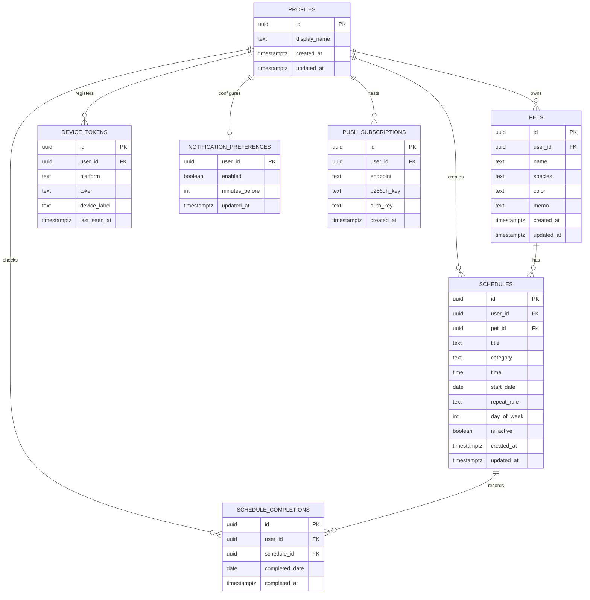

# 챙겨펫

반려동물의 밥, 산책, 약, 병원 일정을 개인별로 관리하고, 오늘 해야 할 일을 체크할 수 있는 모바일 중심 웹/앱 서비스입니다.

현재 구현은 **Next.js 웹 앱을 기반으로 Supabase Auth/DB를 연결하고, Capacitor Android 앱에서 Firebase Cloud Messaging 알림을 받을 수 있는 구조**까지 진행되어 있습니다. 웹은 PC 관리 화면, Android 앱은 실사용 알림과 모바일 확인 화면을 목표로 합니다.

## 프로젝트 목표

- 반려동물별 반복 일정을 한곳에서 관리
- 오늘 해야 할 일정과 완료 상태를 빠르게 확인
- 사용자별 데이터 분리와 Row Level Security 적용
- Android 앱 푸시 알림 기반의 실사용 알림 구조 설계
- 포트폴리오와 면접에서 설명 가능한 단계적 구현

## 주요 기능

- Supabase Auth 기반 회원가입, 로그인, 로그아웃
- 로그인 사용자별 반려동물 등록 및 조회
- 반려동물별 일정 등록 및 조회
- 매일/매주/반복 없음 일정 규칙 처리
- 오늘 일정 완료 체크 저장
- 일정 완료 상태를 `schedule_completions`로 분리 저장
- 설정 화면에서 이메일 일부 마스킹
- Android 앱 푸시 알림 켜기/끄기
- FCM 디바이스 토큰 저장
- 앱 테스트 알림 발송
- 웹/PWA 푸시 테스트 기능 분리

## 기술 스택

| 영역 | 기술 |
| --- | --- |
| Frontend | Next.js App Router, React, TypeScript |
| Styling | Tailwind CSS |
| Auth | Supabase Auth |
| Database | Supabase PostgreSQL |
| Security | Supabase Row Level Security |
| Android App | Capacitor Android |
| Push | Firebase Cloud Messaging, Web Push |
| 배포 예정 | Vercel, Supabase |

## 아키텍처

```txt
사용자
  ├─ Web Browser
  │   └─ Next.js App Router
  │       ├─ Server Components
  │       ├─ Server Actions
  │       └─ Supabase SSR Client
  │
  └─ Android App
      └─ Capacitor WebView
          └─ Next.js 화면 재사용

Next.js
  ├─ Supabase Auth
  ├─ Supabase PostgreSQL
  └─ Firebase Cloud Messaging HTTP v1

Supabase
  ├─ pets
  ├─ schedules
  ├─ schedule_completions
  ├─ device_tokens
  ├─ notification_preferences
  └─ push_subscriptions
```

## 데이터 설계 요약

반복 일정을 매일 미리 생성하지 않고, 일정 원본과 완료 기록을 분리했습니다.

- `schedules`: 반복 규칙을 가진 일정 원본
- `schedule_completions`: 특정 날짜에 사용자가 완료 체크한 기록
- `pets`: 사용자별 반려동물
- `device_tokens`: Android 앱 푸시 수신 토큰
- `notification_preferences`: 알림 사용 여부와 사전 알림 시간
- `push_subscriptions`: 웹 푸시 테스트용 구독 정보

이 구조를 선택한 이유는 반복 일정이 많아져도 DB row가 불필요하게 늘어나지 않고, 완료 기록만 날짜별로 저장할 수 있기 때문입니다.

자세한 DB 설계는 [docs/DATABASE.md](docs/DATABASE.md)를 참고합니다.

## ERD



## API / Server Action 요약

챙겨펫은 Next.js App Router 구조라 별도 REST API Controller보다 Route Handler와 Server Action을 중심으로 동작합니다. 자세한 흐름은 [docs/API.md](docs/API.md)를 참고합니다.

| 구분 | 화면 | 처리 단위 | DB/외부 서비스 | 상태 |
| --- | --- | --- | --- | --- |
| 회원가입 | `/signup` | `src/app/auth/signup/route.ts` | Supabase Auth | 구현 |
| 로그인 | `/login` | `src/app/auth/login/route.ts` | Supabase Auth | 구현 |
| 로그아웃 | 공통 헤더/설정 | `LogoutButton` | Supabase Auth | 구현 |
| 반려동물 등록 | `/pets` | `createPetAction` | `pets` | 구현 |
| 반려동물 조회 | `/pets`, `/schedules`, `/` | Server Component query | `pets` | 구현 |
| 일정 등록 | `/schedules` | `createScheduleAction` | `schedules` | 구현 |
| 일정 조회 | `/schedules`, `/` | Server Component query | `schedules` | 구현 |
| 오늘 완료 체크 | `/` | `toggleScheduleCompletionAction` | `schedule_completions` | 구현 |
| 알림 설정 저장 | `/settings` | `saveNotificationPreferenceAction` | `notification_preferences` | 구현 |
| Android 토큰 저장 | `/settings` | `saveDeviceTokenAction` | `device_tokens` | 구현 |
| 테스트 푸시 발송 | `/settings` | `sendTestAppPushNotificationAction` | Firebase Cloud Messaging | 구현 |
| 예약 푸시 발송 | 서버 작업 예정 | Cron 또는 Edge Function 후보 | `schedules`, `device_tokens` | 개선 예정 |

## 보안 고려

- `.env.local`은 Git에 커밋하지 않습니다.
- Firebase Admin private key는 서버 환경 변수로만 사용합니다.
- Supabase service role key는 브라우저에 노출하지 않습니다.
- 사용자 데이터는 `auth.uid() = user_id` 기준 RLS로 분리합니다.
- 화면에 표시되는 이메일은 일부 마스킹합니다.
- 알림 토큰은 알림 발송 목적으로만 저장합니다.

## 폴더 구조

```txt
src/app
```

Next.js 라우트와 페이지를 관리합니다.

```txt
src/features
```

기능별 UI, 액션, 타입, 조회 로직을 관리합니다.

```txt
src/components
```

공통 레이아웃과 공통 UI를 관리합니다.

```txt
src/lib
```

Supabase 클라이언트, 개인정보 처리 같은 공통 유틸을 관리합니다.

```txt
supabase/migrations
```

DB 테이블, 인덱스, RLS 정책 SQL을 관리합니다.

```txt
android
```

Capacitor Android 프로젝트입니다.

## 환경 변수

`.env.example`을 참고해 `.env.local`을 만듭니다.

```txt
NEXT_PUBLIC_SUPABASE_URL=
NEXT_PUBLIC_SUPABASE_ANON_KEY=
NEXT_PUBLIC_VAPID_PUBLIC_KEY=
VAPID_PRIVATE_KEY=
VAPID_SUBJECT=mailto:admin@chaenggyeo-pet.local
FIREBASE_PROJECT_ID=
FIREBASE_CLIENT_EMAIL=
FIREBASE_PRIVATE_KEY=
```

주의: `FIREBASE_PRIVATE_KEY`는 따옴표를 포함해 한 줄 문자열로 넣고, 줄바꿈은 `\n` 형태로 보관합니다.

## 실행 방법

의존성 설치:

```bash
npm.cmd install
```

웹 개발 서버 실행:

```bash
npm.cmd run dev
```

브라우저 접속:

```txt
http://localhost:3000
```

Android 에뮬레이터 개발 실행:

```bash
npm.cmd run android:dev
```

Android 개발 모드에서는 앱이 PC의 Next.js 개발 서버를 바라봅니다.

```txt
http://10.0.2.2:3000
```

따라서 Android 앱을 테스트할 때는 `npm.cmd run dev`가 먼저 켜져 있어야 합니다.

## 검증 방법

```bash
npm.cmd run lint
npm.cmd run typecheck
npm.cmd run build
```

전체 확인:

```bash
npm.cmd run check
```

## 현재 진행 상태

| 영역 | 현재 상태 |
| --- | --- |
| 인증 | Supabase Auth 기반 회원가입, 로그인, 로그아웃 구현 |
| 데이터 보안 | 사용자별 `user_id`와 RLS 정책으로 개인 데이터 분리 |
| 반려동물 | 등록과 조회 구현, 일정 등록 시 반려동물 선택 연동 |
| 일정 | 일정 등록, 조회, 매일/매주/반복 없음 규칙 처리 구현 |
| 완료 체크 | 날짜별 완료 기록을 `schedule_completions`에 저장하고 홈 화면에 반영 |
| 설정 | 이메일 마스킹, 로그아웃, 알림 설정 저장 구조 구현 |
| Android 앱 | Capacitor 기반 Android 앱 실행, Next.js 화면 재사용 구조 구성 |
| 앱 푸시 | FCM 토큰 저장, 알림 권한 요청, 테스트 푸시 발송 흐름 구현 |
| 웹 푸시 | 개발 검증용 패널로 분리하고 Android 앱 화면에서는 숨김 처리 |
| 문서화 | DB 설계, API 흐름, Android 전환 방향, 작업 원칙 문서 작성 |

## 추후 개선 작업

- 예약 알림 자동 발송을 서버 Cron, Supabase Edge Function, 또는 별도 백엔드 작업으로 분리
- 반려동물 수정/삭제 기능 추가
- 일정 수정/삭제 기능 추가
- 알림 수신 기기 목록과 기기별 알림 해제 기능 추가
- Android 배포용 빌드, 앱 서명, 아이콘, 스플래시, 스토어 등록 문서 정리
- 실제 운영 환경 기준의 로깅, 에러 추적, 모니터링 도입
- SMS/알림톡은 비용과 개인정보 동의 범위를 검토한 뒤 선택 기능으로 판단
